# PyCon AU Archives

The goal of this project is to archive the past PyCon AU websites. 

*This project is heavily inspired by the [DjangoCon Archive Project](https://github.com/djangocon/djangocon-archive-project)*

---
| year | url | status | wayback | repo | youtube | pyvideo |
|-----|-----|-----|-----|-----|-----|-----|
| 2010 | [pycon-au.org/2010](https://pycon-au.org/2010) | 404 | [wayback](https://web.archive.org/web/20160406095737/http://pycon-au.org/2010/) | [pyconau/2010-archive](https://github.com/pyconau/2010-archive) 🚧  | ❓ | [30 entries](https://pyvideo.org/events/pycon-au-2010.html) |
| 2011 | [pycon-au.org/2011](https://pycon-au.org/2011) | 404 | [wayback](http://web.archive.org/web/20111106005504/http://pycon-au.org/2011/about/) | [pyconau/2011-archive](https://github.com/pyconau/2011-archive) 🚧  | [1](https://www.youtube.com/playlist?list=PLF92F453065088216), [2](https://www.youtube.com/playlist?list=PL8C2EF847D694C589) | [30 entries](https://pyvideo.org/events/pycon-au-2011.html) |
| 2012 | [2012.pycon-au.org](https://2012.pycon-au.org) | ✅ | [wayback](https://web.archive.org/web/20130317004629/http://2012.pycon-au.org/) | [pyconau/2012-archive](https://github.com/pyconau/2012-archive) ✅  | [1](https://www.youtube.com/playlist?list=PLC76ACB3B5EC1FC62), [2](https://www.youtube.com/playlist?list=PL3D60EF5F416451F9) | [30 entries](https://pyvideo.org/events/pycon-au-2012.html) |
| 2013 | [2013.pycon-au.org](https://2013.pycon-au.org) | ✅ | [wayback](https://web.archive.org/web/20150307051807/http://2013.pycon-au.org/) | [pyconau/2013-archive](https://github.com/pyconau/2013-archive) ✅  | [1](https://www.youtube.com/playlist?list=PLs4CJRBY5F1KDIN6pv6daYWN_RnFOYvt0), [2](https://www.youtube.com/playlist?list=PLs4CJRBY5F1IQocKOGLvXG83SJ2l3ip8M), [3](https://www.youtube.com/playlist?list=PLs4CJRBY5F1Lh7S3kjtsQpWsOt_KNDWzC) | [45 entries](https://pyvideo.org/events/pycon-au-2013.html) |
| 2014 | [2014.pycon-au.org](https://2014.pycon-au.org) | ✅ | [wayback](https://web.archive.org/web/20150324055746/http://2014.pycon-au.org/) | [pyconau/2014-archive](https://github.com/pyconau/2014-archive) ✅  | [1](https://www.youtube.com/playlist?list=PLs4CJRBY5F1Jm7H1dlesRvEgr-28QGXpR), [2](https://www.youtube.com/playlist?list=PLs4CJRBY5F1JQV44fKjRwjnh3CSTyJvOH), [3](https://www.youtube.com/playlist?list=PLs4CJRBY5F1Kh1MjzKODWS55D9NAIYT44), [4](https://www.youtube.com/playlist?list=PLs4CJRBY5F1KiJfxHRfJ3APQG7YqQbM3s), [5](https://www.youtube.com/playlist?list=PLs4CJRBY5F1IA1dS8EgK7SzN54dzm-0QB) | [46 entries](https://pyvideo.org/events/pycon-au-2014.html) |
| 2015 | [2015.pycon-au.org](https://2015.pycon-au.org) | ✅ | [wayback](https://web.archive.org/web/20160322142419/http://2015.pycon-au.org/) | [pyconau/2015-archive](https://github.com/pyconau/2015-archive) ✅  | [1](https://www.youtube.com/playlist?list=PLs4CJRBY5F1KMMpoEWMuBRvHvjBJeAJoS), [2](https://www.youtube.com/playlist?list=PLs4CJRBY5F1LvjmMRjvSUnGJCWGvhRxtI), [3](https://www.youtube.com/playlist?list=PLs4CJRBY5F1IZYVBLXGX1DRYXHMjUjG8k), [4](https://www.youtube.com/playlist?list=PLs4CJRBY5F1IvHnT3OvHOB49laSsULy_V), [5](https://www.youtube.com/playlist?list=PLs4CJRBY5F1LZECyoAZWhWkaJpF5NHQZW), [6](https://www.youtube.com/playlist?list=PLs4CJRBY5F1I5vuApyUXp6bLWly1E-b0s) | [81 entries](https://pyvideo.org/events/pycon-au-2016.html) |
| 2016 | [2016.pycon-au.org](https://2016.pycon-au.org) | ✅ | [wayback](https://web.archive.org/web/20200619053145/https://2016.pycon-au.org/) | [pyconau/2016-archive](https://github.com/pyconau/2016-archive) ✅  | [1](https://www.youtube.com/playlist?list=PLs4CJRBY5F1IU2xckJUEj5ILWd4cta3vo), [2](https://www.youtube.com/playlist?list=PLs4CJRBY5F1JufM2b_FaQT-MTWWx5Oj0o), [3](https://www.youtube.com/playlist?list=PLs4CJRBY5F1J8D2LWQPoCo4Y6Q2G2Grsk), [4](https://www.youtube.com/playlist?list=PLs4CJRBY5F1Jn2JbfMLX8vblYMC_kKjp-), [5](https://www.youtube.com/playlist?list=PLs4CJRBY5F1Jh6fFqT1p5TZRx5q06CcaR) | [81 entries](https://pyvideo.org/events/pycon-au-2016.html) |
| 2017 | [2017.pycon-au.org](https://2017.pycon-au.org) | ✅ | [wayback](https://web.archive.org/web/20210302051807/https://2017.pycon-au.org/) | [pyconau/2017-archive](https://github.com/pyconau/2017-archive) ✅  | [1](https://www.youtube.com/playlist?list=PLs4CJRBY5F1KsK4AbFaPsUT8X8iXc7X84) | [84 entries](https://pyvideo.org/events/pycon-au-2017.html) |
| 2018 | [2018.pycon-au.org](https://2018.pycon-au.org) | ✅ | [wayback](http://web.archive.org/web/20210218221524/https://2018.pycon-au.org/) | [pyconau/2018.pycon-au.org](https://github.com/pyconau/2018.pycon-au.org) ✅  | [1](https://www.youtube.com/playlist?list=PLs4CJRBY5F1KrUr7z_2mur2QdAKXyh-k3) | [78 entries](https://pyvideo.org/events/pycon-au-2018.html) |
| 2019 | [2019.pycon-au.org](https://2019.pycon-au.org) | ✅ | [wayback](https://web.archive.org/web/20210917222732/https://2019.pycon-au.org/) | [pyconau/2019.pycon-au.org](https://github.com/pyconau/2019.pycon-au.org) ✅  | [1](https://www.youtube.com/playlist?list=PLs4CJRBY5F1LKqauI3V4E_xflt6Gow611) | [74 entries](https://pyvideo.org/events/pycon-au-2019.html) |
| 2020 | [2020.pycon.org.au](https://2020.pycon.org.au) | ✅ | [wayback](https://web.archive.org/web/20210917223013/https://2020.pycon.org.au/) | [pyconau/2020-website](https://github.com/pyconau/2020-website) ✅  | [1](https://www.youtube.com/playlist?list=PLs4CJRBY5F1IEFq-wumrBDRCu2EqkpY-R), [2](https://www.youtube.com/playlist?list=PLs4CJRBY5F1LZOAnnNuusV0JqpIJunp59) | ❓ |
| 2021 | [2021.pycon.org.au](https://2021.pycon.org.au) | ✅ | [wayback](https://web.archive.org/web/20210917223112/https://2021.pycon.org.au/) | [pyconau/2021-website](https://github.com/pyconau/2021-website) ✅  | [1](https://www.youtube.com/playlist?list=PLs4CJRBY5F1LKN2ISCse415LW5FZEjDX2) | [54 entries](https://pyvideo.org/events/pycon-au-2021.html) |
| 2022 | [2022.pycon.org.au](https://2022.pycon.org.au) | ✅ | [wayback](None) | [pyconau/2022-website](https://github.com/pyconau/2022-website) ✅  | N/A | N/A |

### Notes

* 2013: some sponsor logos missing
* 2014: Missing Friday data
* 2016: Missing Saturday and Sunday data
* 2017: Missing talk data

## Screenshots
Screenshots are in the form: WayBack Machine screenshot, GitHub Pages screenshot.

### 2010

### 2011
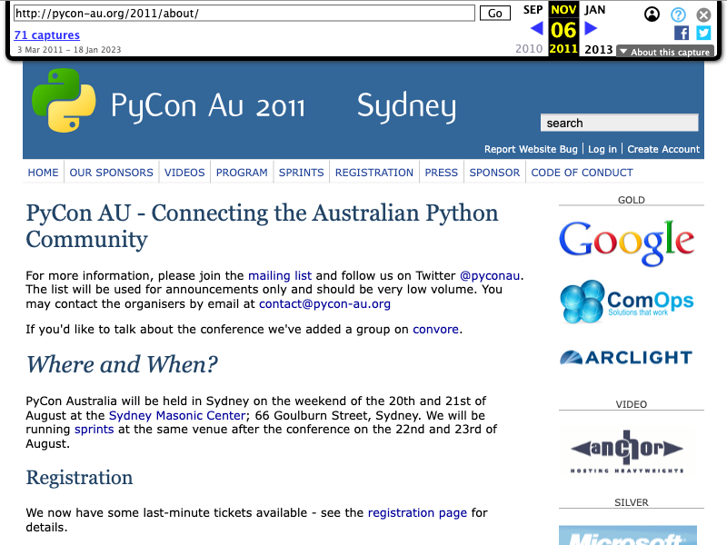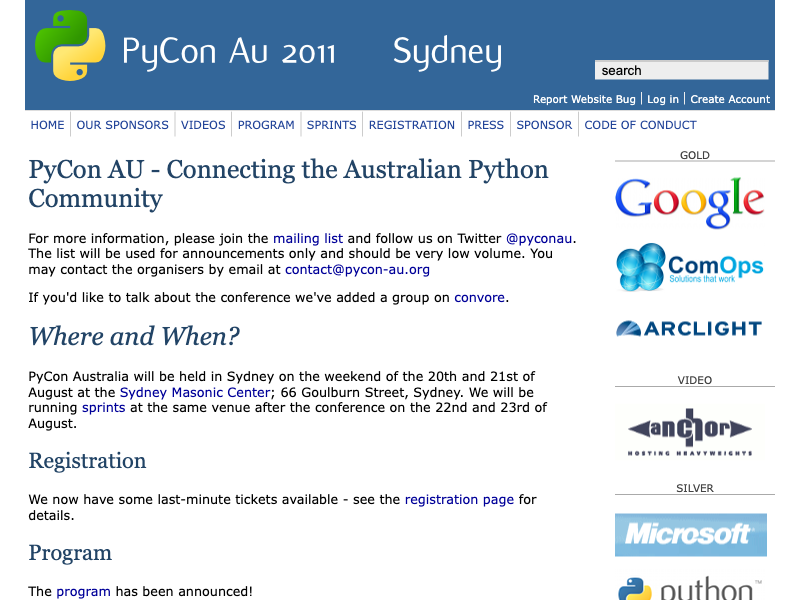

### 2012

### 2013
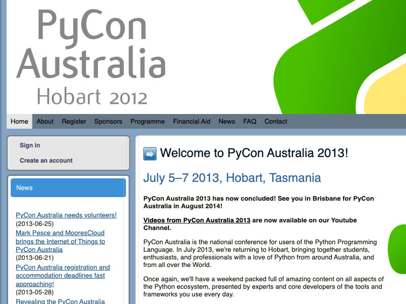

### 2014
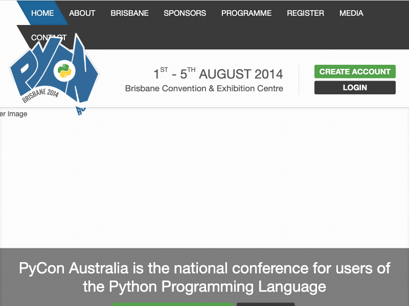

### 2015
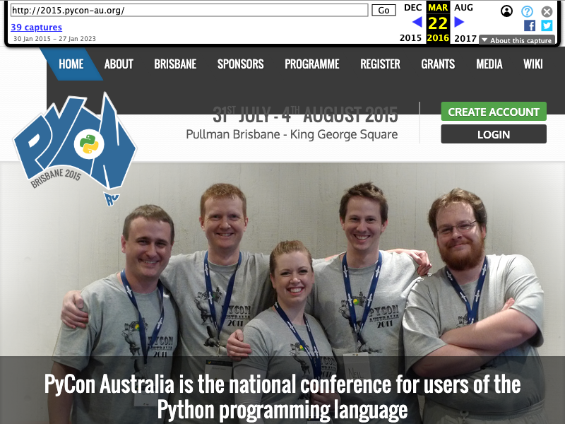

### 2016
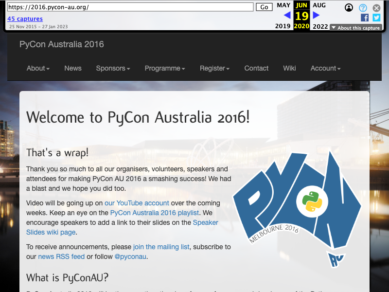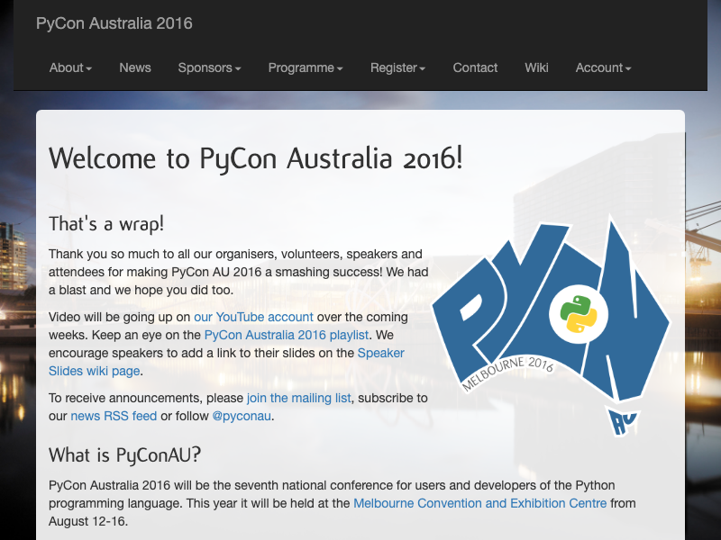

### 2017
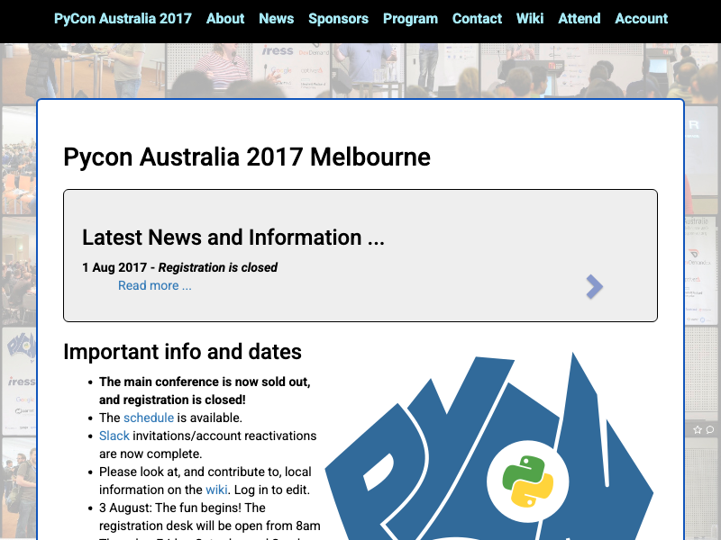

### 2018

### 2019
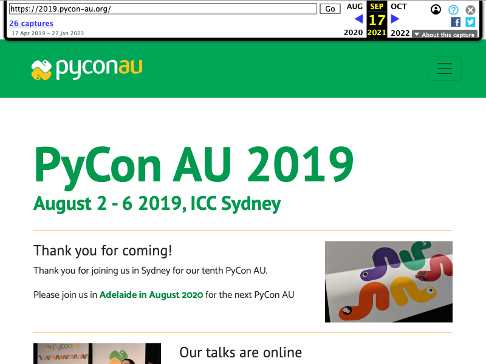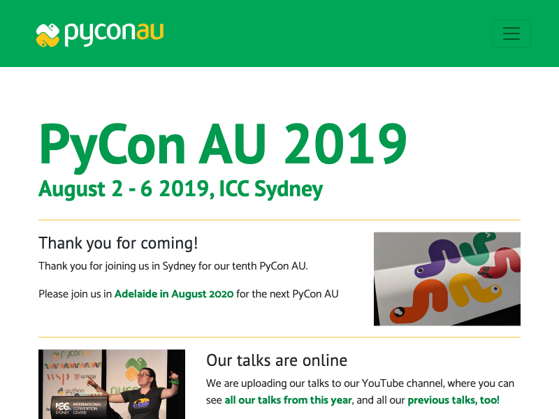

### 2020

### 2021
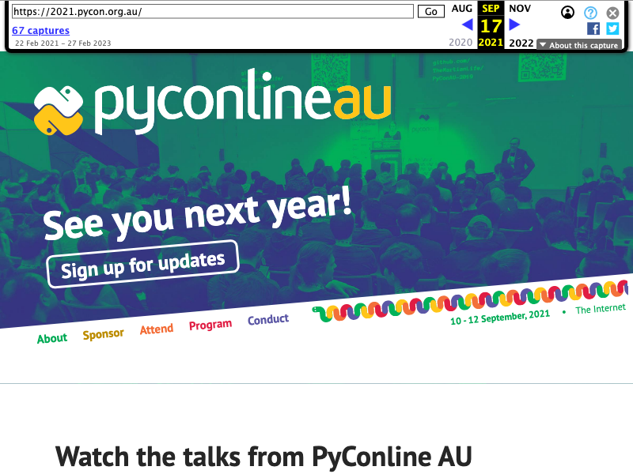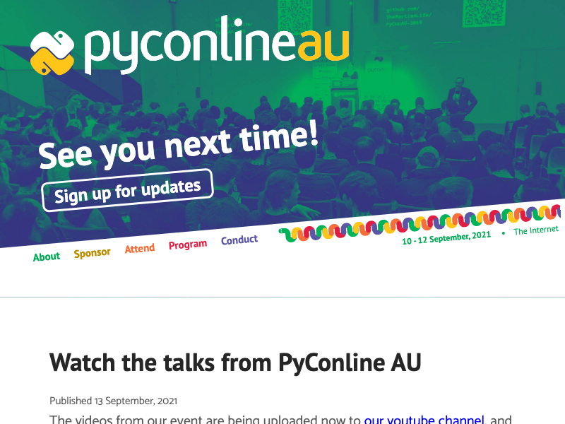

### 2022
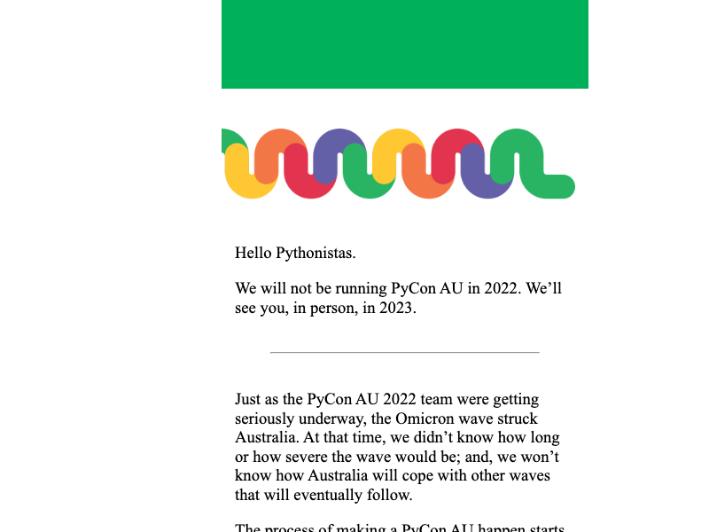
---

This file was generated. See `docs.md`.
